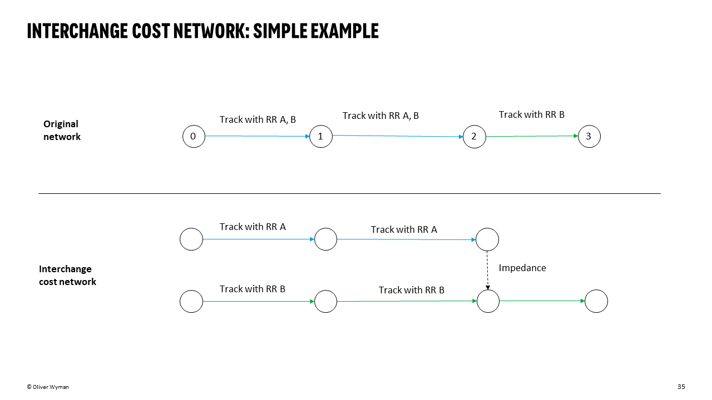
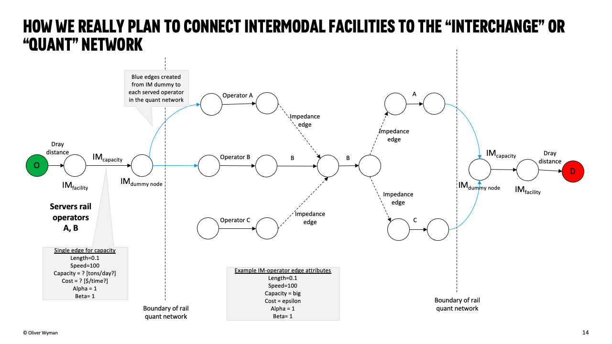

============
Rail network
============

The rail network is the most complex network within the project.

The network can be constructed from:

* NARN data
* Intermodal terminal data

But the NARN data alone is insufficient to construct a "realistic"
rail network because it does not account for interchange costs among
operators. To do so, we need to examine the railroad owners and railroad
operators with trackage rights on each edge.

Given each edge's set of owner/operators, we can create subgraphs of
the entire NARN graph by owner/operator (one subgraph for each operator)
and join the subgraphs with "impedance" edges that represent interchange
"costs."

These are accomplished through:

.. automodule:: ireiat.data_pipeline.assets.rail_network.impedance
    :members:
    :private-members:

Note that because there are 900+ owner operators, we only use a subset - but cover ~80% of
the relevant rail network edges. Thus, we may not account for some short line interchange fees.

For intermodal facilities, we connect each facility to the impedance graph by adding two new vertices:

1. **Intermodal Terminal**: Represents the intermodal terminal.
2. **Intermodal Dummy Node**: Serves as an intermediary connection point for calculating intermodal capacities and costs.

These two nodes are linked by a pair of **Intermodal Capacity** edges. Each dummy node is then connected to existing
rail network nodes based on the terminal's railroad operators using **Rail to Quant** or **Quant to Rail** edges.

After constructing the rail network graph, we prepare it for solving the Traffic Assignment Problem (TAP).
This process involves converting the rail network graph into a dataframe that includes essential attributes
like speed, free-flow travel time, link capacities, and congestion parameters (alpha and beta) for each link.

Assumptions
===========

1. **Speed**: Default rail speed is set to 20 miles per hour (mph).

2. **Capacity**: For intermodal terminal links, the capacity is set to 100,000 tons to reflect the higher throughput 
   of intermodal operations. For standard rail links, the capacity is set to 60,000 tons.

3. **Congestion Parameters (Alpha and Beta)**: For **intermodal terminal links**, we use **alpha = 1** and **beta = 1**, 
   assuming that congestion is mostly capacity-based and linear. For **standard rail links**, we use **alpha = 0.1** and 
   **beta = 3.5** to account for less sensitivity to congestion compared to roads but still reflecting some non-linear impacts.

4. **Free-Flow Travel Time (fft)**: This is calculated as the ratio of link length to speed, representing the time it 
   takes to traverse a link under ideal conditions.

